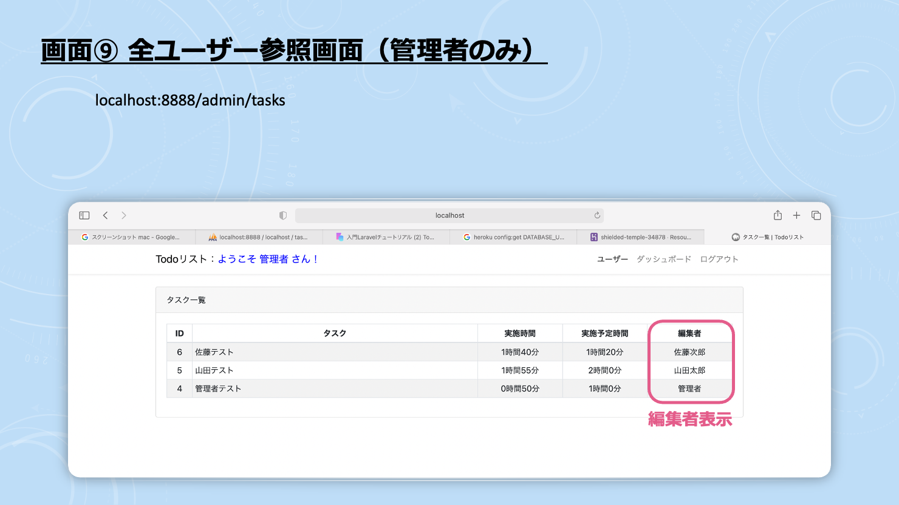

## 開発環境

### 使用言語
・PHP 7.4.12  
・MySQL 5.7.32  

### フレームワーク
・laravel 8.27.0  

### OS
・macOS Big Sur 11.1 

## 環境構築

### 開発環境の構築
・MAMPを用いたローカル環境の構築

### 必要なパッケージのインストール
・composer（phpの管理パッケージ）  
・laravel (php開発環境のフレームワーク)  

### 初期設定
・タイムゾーンや言語の設定  
・設定ファイルの変更

## 機能一覧
※ 以下の番号は，「デモ画面」の番号に対応

### 基本機能
画面①,③：未完タスクの一覧表示  
画面②：タスクの登録  
画面③：タスクの登録後，タスクの削除が可能  
画面④：タスクの登録後，編集が可能  
画面④：タスクの登録後，実施時間記録が可能  
画面④：「タスクを完了する」にチェックを入れることで，タスク完了  
画面⑤：タスク完了後，完了済みのタスクを閲覧可能（同時に，RATEの確認も可能）  

### ユーザー機能
※ Todoリスト機能は，基本機能と同一  
画面⑥：アカウント作成済みの方は，ログイン可能  
画面⑥：Twitterアカウント保持者は，Twitterでログイン可能（ユーザー名，パスワード入力不要）  
画面⑦：アカウント未作成者は，新規登録でログイン（次回以降，ログイン可能）  
画面⑦：新規登録時は，追加でパスワード確認を行う  
画面⑦：Twitterアカウント保持者は，Twitterで新規登録（次回以降，ログイン可能）  
画面⑧：個人ユーザーとして仕様する場合，「ようこそ〇〇さん」と表示  
画面⑨：個人ユーザーが管理者の場合，各ユーザーのタスクが閲覧可能  

## 機能の工夫点及び導入理由
◯ RATE機能の導入  
(理由) ユーザーが正確にタスクの時間を見積もることを手助けするため．  
(現状) 人間：1つのタスクに対し，タスクの実施時間が実施予定時間よりも約3倍かかると言われている．  
　　　 すなわち，人間はタスクの時間見積もりが苦手である傾向がある．  
(提案) そこで，時間見積もりの定量的指標として，「RATE機能」を追加する．  
　　　　※ RATE ... 実施予定時間／実施時間 (1.0に近づくほど，正確な見積もりができることを表す．)  
(使用法) RATEはタスク完了時に，タスク完了画面で確認できる．  
　　　　 本Todoリストを日々使い続けるなかで，RATEをもとに正確に実施予定時間を見積もる力を身につける．  
(効果) 正確に時間の見積もりが行えることで，時間を有効活用できる感覚を養うことを目標としている．  
　　　 同時に，自己肯定感の向上に結びつくとも考えている．    

## デモ画面
【デモ画面のリンク】https://shielded-temple-34878.herokuapp.com  
  
  
  
  
  
  
  
  
  
  

## 注意点
・レスポンシブ非対応のため，スマートフォンの画面では画面が崩れる場合があります． 

## 今後の展望
・レスポンシブ対応  
・アンケート調査により，RATEの基準設定  
・タスク全体の平均RATEの表示  
・カテゴリー別の仕分け機能の追加   

## 参考リンク
MAMPを用いた環境構築法 ... https://www.youtube.com/watch?v=8jMnqeCiYDM&t=0s  
パッケージのインストール ... https://youtu.be/yaitzPzBzuI  
タイムゾーン／言語設定 ... https://shizuoka-turi.com/laravel-vue-js/laravel-first-step  
設定ファイルの変更 ... http://localhost:8888/MAMP/  
